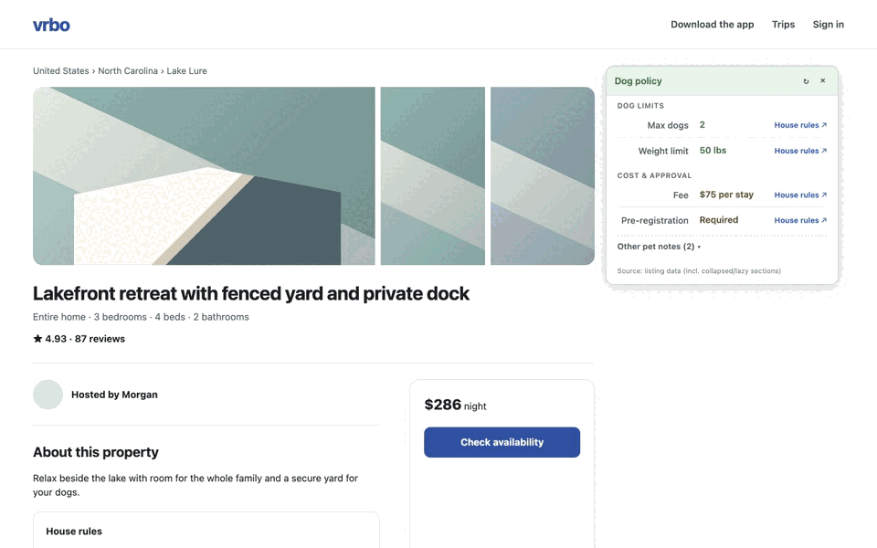
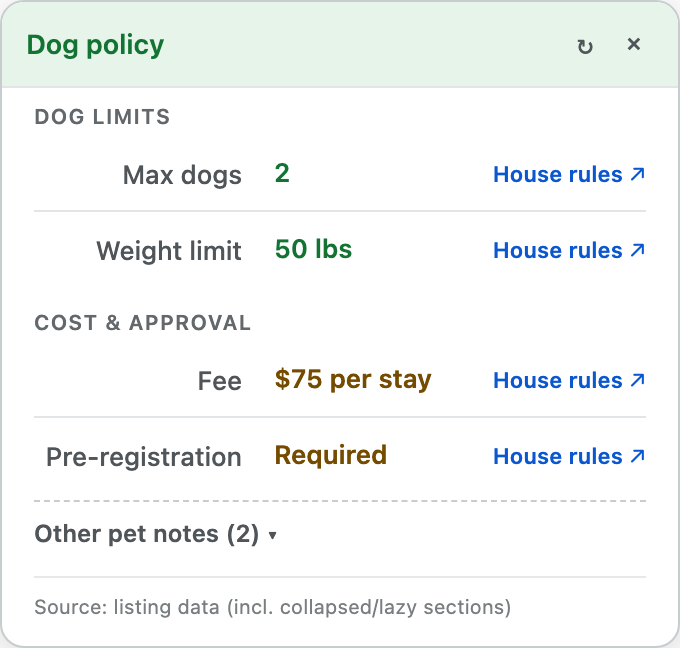

# Vrbow: Dog Policy Callout

**A Chrome extension that extracts pet rules from Vrbo, Airbnb, and Expedia listings and shows them in a summary card.**

 

---

## Why?

Booking sites do not present pet policies in a consistent place. Hosts may put restrictions in House Rules, Amenities, About this property, hotel policy sections, or structured page metadata. Rules can also conflict within the same listing.

A property marked Pets allowed may still have limits on dog count, weight, fees, breeds, or require prior host approval. Checking all of this manually across several listings gets tedious quickly.

## What

When you open a supported listing, the extension reads the available pet policy data and consolidates it into an on-page summary card in the top-right corner:

- Whether dogs are allowed
- Maximum number of dogs and weight limits
- Pet fees or refundable deposits
- Registration or prior approval requirements
- Other guidelines (such as leash rules or breed limits)

- **Source verification**: Click the **source** link next to any value to jump directly to and highlight the original text on the listing.
- **Contradiction alerts (⚠️)**: If two sections contain conflicting rules, the card flags the discrepancy rather than attempting to decide which one is authoritative.
- **Rescan (↻)**: Click the refresh icon to re-scan if a listing page loads slowly.
- **Data source footer**: Indicates whether data was extracted from structured listing data or visible page text.

## Search Result Badges

The extension can also add pet policy badges directly to Vrbo search results, making it easier to compare properties without opening each listing. Hovering or focusing on any badge opens an interactive details tooltip.

### Badge Statuses

-  — Fetching policy data in the background
-  — Dogs allowed with count, weight, and fee summary
-  — Tiered or multi-part pet fee structure
-  — Pet restrictions or approval required
-  — Explicitly prohibited
-  — Verification needed or details unavailable in search

### Retrieval & Performance
- **Disabled by default**: Search enrichment is off by default because it retrieves policy details for individual properties. Enable it in settings when useful.
- **Adaptive request pacing**: Employs an adaptive backoff ladder (800 ms base delay, scaling up to 3200 ms under rate limits or error clusters), global 250 ms dispatch floor, one-sided jitter, dwell debouncing (400–600 ms), and a 24-hour local cache to minimize load on Vrbo.

## Privacy & Theming

- **100% Local**: Processing and storage remain strictly inside your browser. No personal data, browsing activity, or telemetry is sent to any external service.
- **Theme Matching**: The interface automatically follows your system light or dark mode preference.

---

## Installation & Setup

1. Download **`vrbow-v1.4.0.zip`** from [Releases](https://github.com/curdriceaurora/vrbow/releases).
2. Unzip the file into a folder on your computer.
3. Open `chrome://extensions` in your browser.
4. Turn on **Developer mode** in the top-right corner.
5. Click **Load unpacked** in the top-left corner and select the unzipped folder.
6. *(Optional)* Pin the extension icon to your Chrome toolbar to view summaries directly from the popup menu.

---

## Scope and Alternatives

- **Supported listing pages**: This extension runs on Vrbo, Airbnb, and Expedia property listing pages. Search-result badges currently apply to Vrbo only.
- **Search Alternative**: To search across properties with custom pet filters (such as dog weight, pet count, or fee limits), use [BringFido](https://www.bringfido.com).

## Development and Support

- **Content architecture**: The browser controller delegates URL and storage lifecycle, listing-panel behavior, and Vrbo search badges to separate modules. See [Content Module Contracts](docs/content-module-contracts.md).
- **Search fetcher architecture**: The background search-result fetch queue composes separate pacing, caching, and response-parsing modules. See [Search Fetcher Architecture](docs/search-fetcher-architecture.md).
- **Validation**: Run `npm run test:all` for syntax checks, Node coverage gates, and the Playwright browser suite. See the [Testing Guide](docs/testing.md).
- **Packaging**: Run `npm run build` to create a versioned Chrome-ready archive in `dist/` from the manifest version.
- **AI Vibecoded**: This project was built and vibecoded with AI.
- **As-Is Software**: The extension works as intended. The author provides no guarantee of ongoing support, updates, or maintenance.

---

- [Release Notes & Changelog](CHANGELOG.md)
- [Privacy Policy](PRIVACY.md)
- [License](LICENSE)

> **Note**: Vrbow is an independent open-source tool. It is not affiliated with or endorsed by Vrbo or Expedia Group. No support is guaranteed. Always verify the host's original house rules before you book a property.
